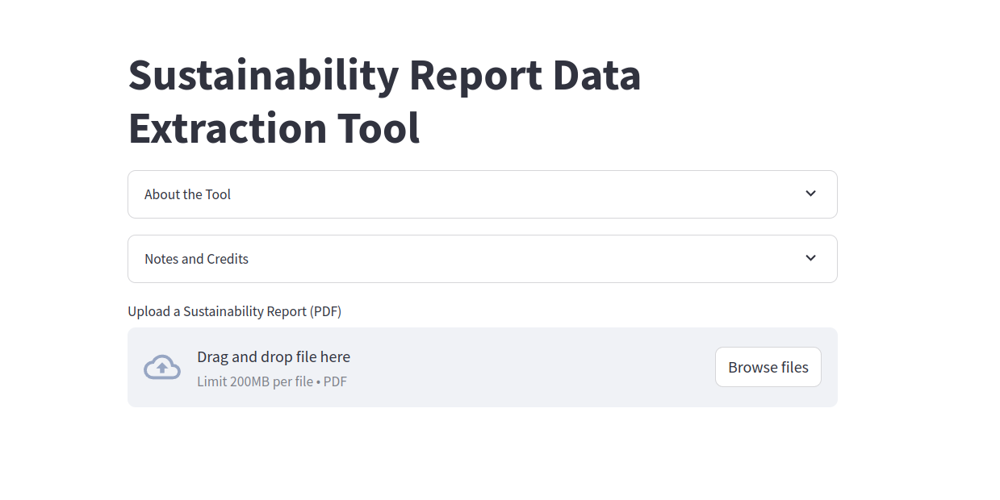
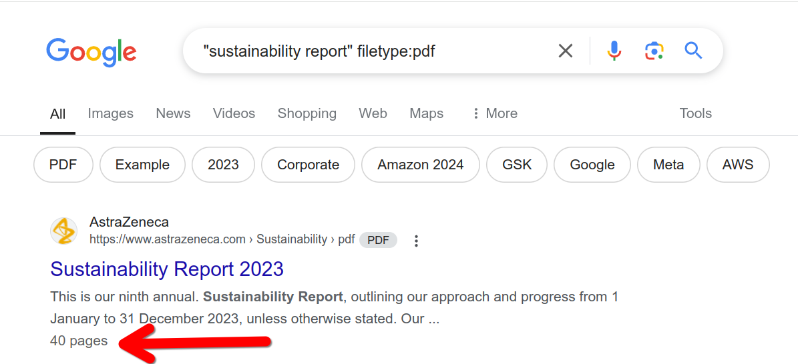
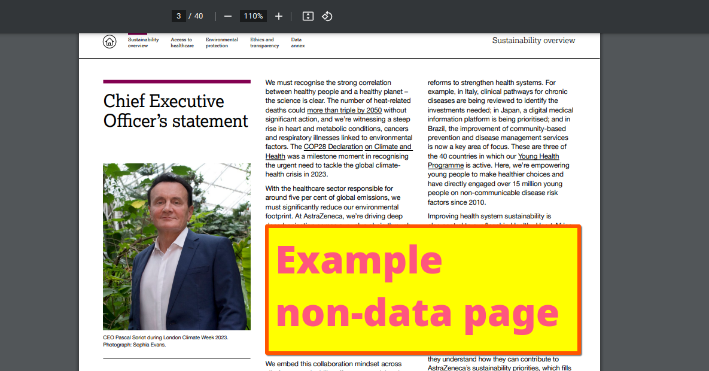
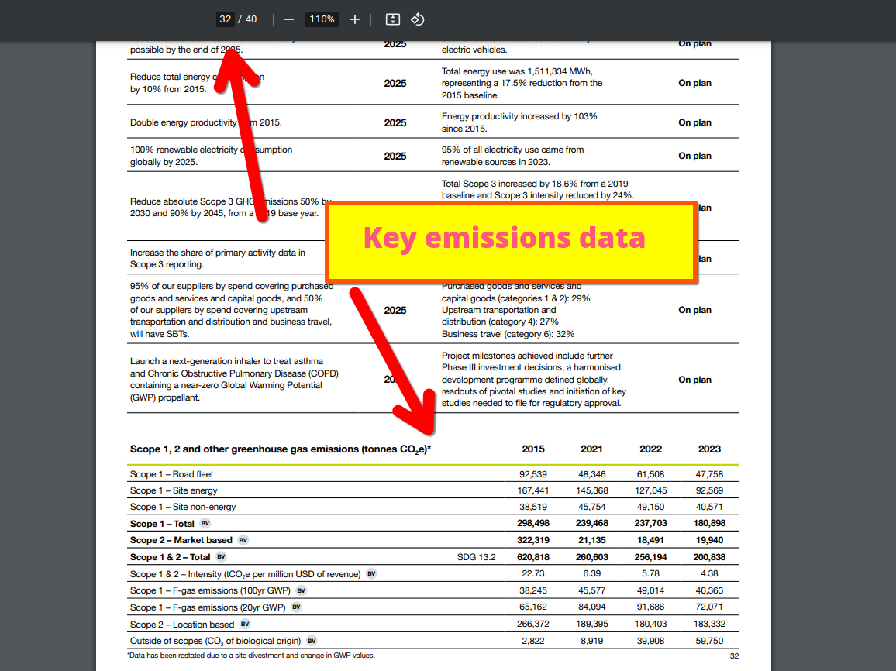
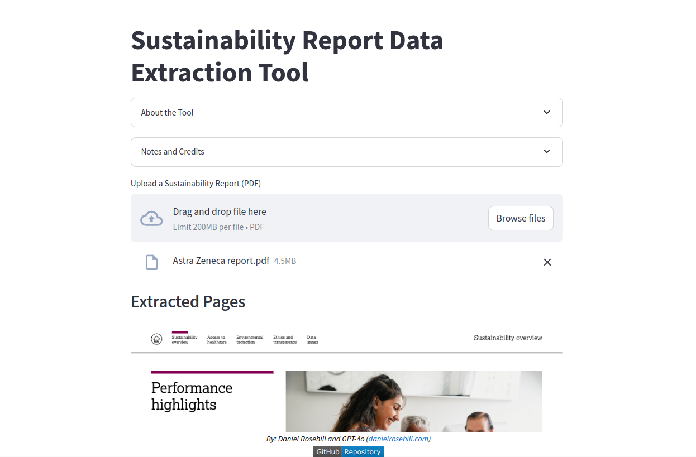
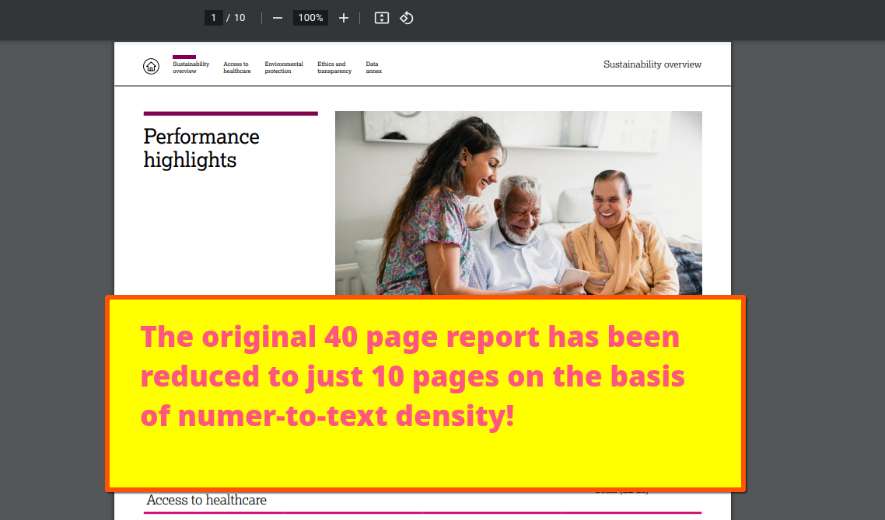

# Sustainability Report Data Extraction Tool



This simple app deployed to Streamlit Cloud is intended to help those reading. sustainability reporting literature to more easily isolate data-containing pages from textual pages in the report. 

The script does so on the basis of the numeric density in the text searching specifically for keywords related to greenhouse gas emission reporting. 

The user uploads the PDF, the program processes it and it then merges the data rich pages into a single abbreviated document, which the user can then preview online and download to their local computer. 

For anyone reading these often lengthy reports, this tool might save some time in identifying where the key reporting data is. Suggested use the script could be integrated into a rag ingestion pipeline. Reducing the amount of data which  Has to be converted to vector storage by a substantial amount.  

## Code snippet

### Keywords for identification
```python
keywords = ["GHG emissions", "Scope 1", "Scope 2", "Scope 3"]
```

Page processing
```python
for i, page in enumerate(reader.pages):
    text = page.extract_text()
    if any(keyword.lower() in text.lower() for keyword in keywords):
        extracted_pages.append(i)
        writer.add_page(page)
```        
---

## Screenshots












## Author

Daniel Rosehill  
(public at danielrosehill dot com)

## Licensing

All my GitHub repositories are licensed under [Creative Commons Attribution 4.0 International](https://creativecommons.org/licenses/by/4.0/).

### Summary of the License
The Creative Commons Attribution 4.0 International (CC BY 4.0) license allows others to:
- **Share**: Copy and redistribute the material in any medium or format.
- **Adapt**: Remix, transform, and build upon the material for any purpose, even commercially.

The licensor cannot revoke these freedoms as long as you follow the license terms.

#### License Terms
- **Attribution**: You must give appropriate credit, provide a link to the license, and indicate if changes were made. You may do so in any reasonable manner, but not in any way that suggests the licensor endorses you or your use.
- **No additional restrictions**: You may not apply legal terms or technological measures that legally restrict others from doing anything the license permits.

For the full legal code, please visit the [Creative Commons website](https://creativecommons.org/licenses/by/4.0/legalcode).